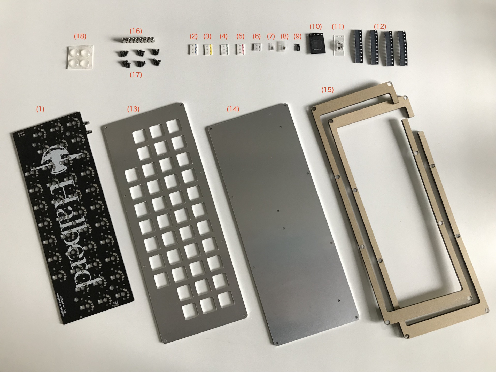
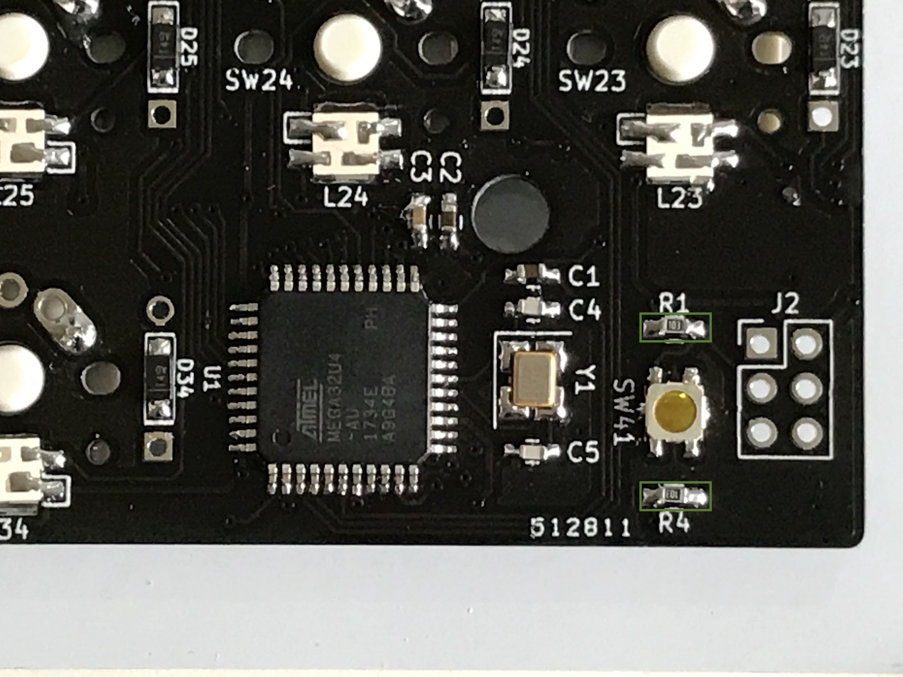
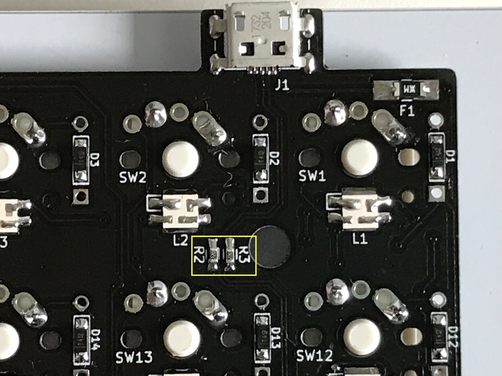
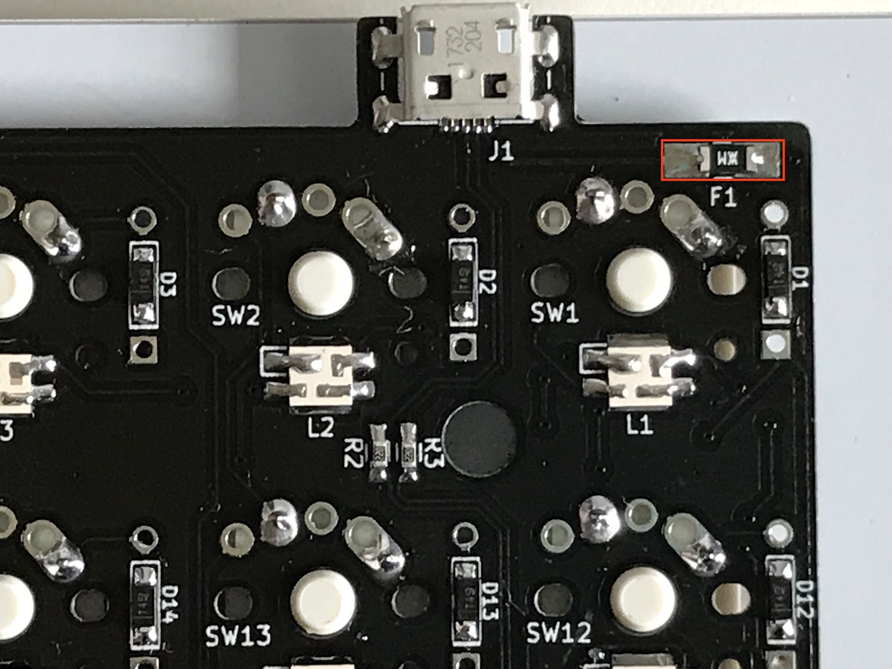
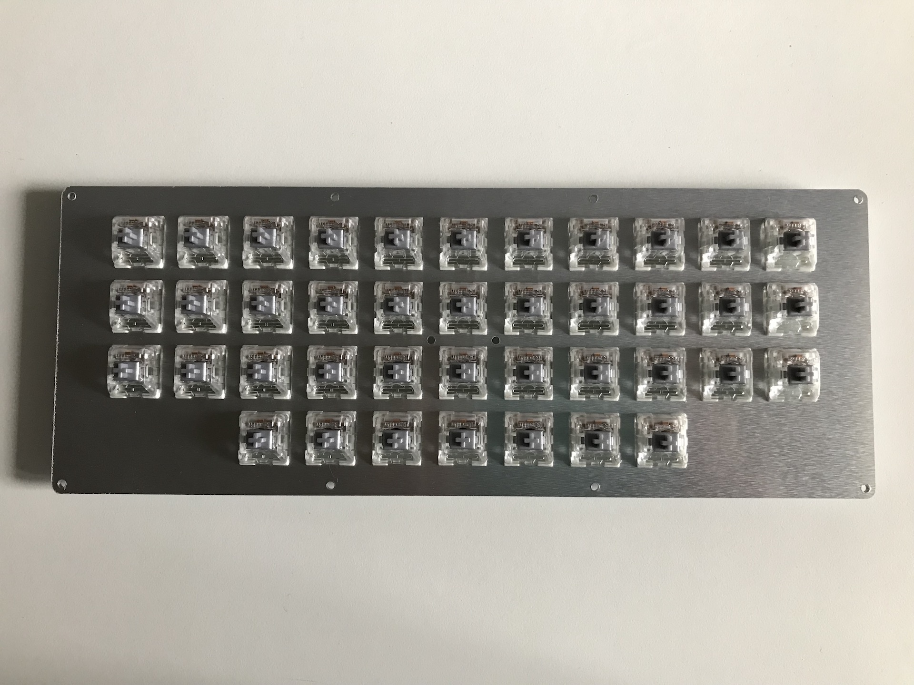
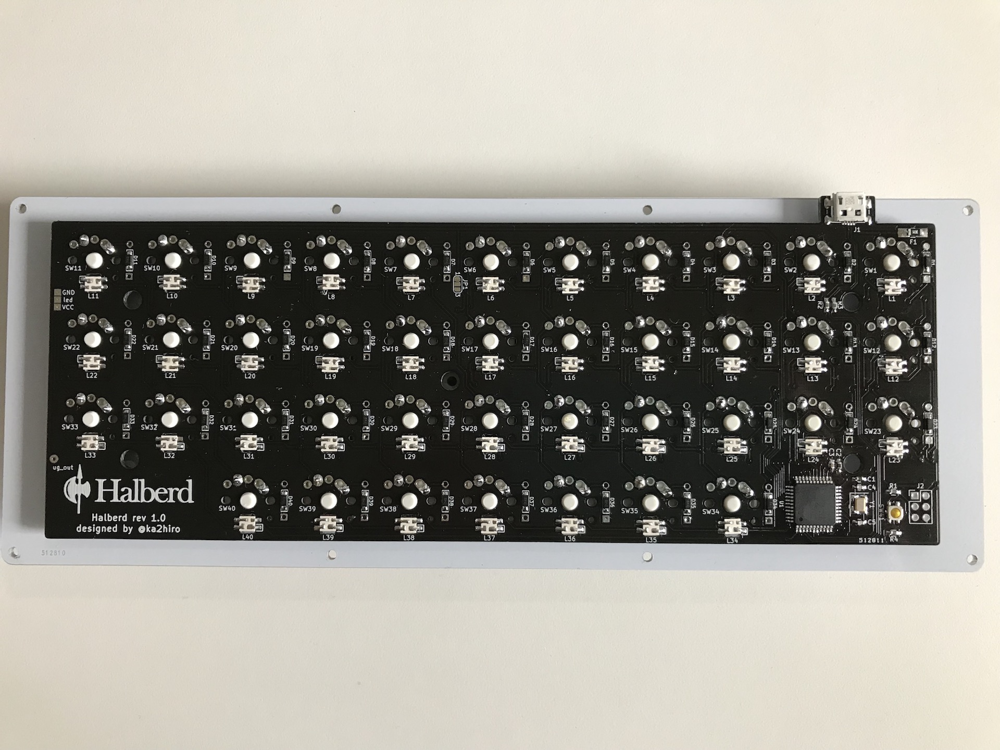
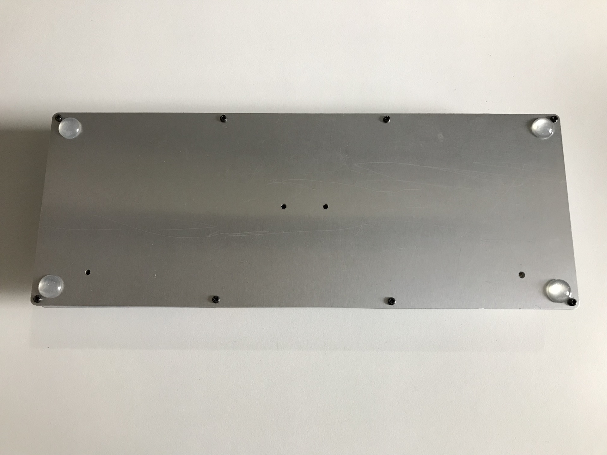

# Halberd 組立説明書

## 組み立ての前に
* はんだごてや工具、部品等でのケガに注意してください。
* 作業中に席を離れるときは、はんだごての電源を確認してください。
* 非常に小さい部品が含まれていますので、失くさないように注意してください。

## 内容物の確認
キットには以下の部品が含まれています。作業前に不足がないか確認してください。

番号 | 名前      | 値     | 個数 | 備考                | 部品番号 |
:----|:--------|:-----|:----|:-----------------|:-------
1  | PCB      |       | 1   |           | |
2  | コンデンサ | 1μF | 3  | 予備1、青マーカ、色が濃い | C1, C2 |
3  | 抵抗      | 22Ω   | 3 | 予備1、黄マーカ、部品本体に"220"という表記あり | R2, R3
4  | 抵抗      | 10kΩ  | 3 | 予備1、緑マーカ、部品本体に"103"という表記あり | R1, R4
5  | コンデンサ | 22pF  | 3 | 予備1、赤マーカ、色が薄い | C4, C5
6  | コンデンサ | 0.1μF | 2 | 予備1、マーカなし    | C3
7  | 水晶発振子 | FA238-16MHz | 1 |                  | Y1
8 | タクトスイッチ | TVAF17-WEC-R | 1 |                  | SW41
9 | ポリスイッチ | nanoSMDC050F/13.2 | 1 |                   | F1
10  | MPU      | ATMEGA32U4-AU | 1 |              | U1
11  | USBコネクタ | MicroB メス | 1 |           | J1 |
12 | ダイオード | 1N4148W | 40 |               | D1 - D40
13 | トッププレート |     | 1 |                 |
14 | ボトムプレート |     | 1 |                 |
15 | ミドルプレート |     | 2 |                 |
16 | M2スペーサ | 6mm | 9 |                   |
17 | M2ネジ    | 5mm | 18 |                   |
18 | ゴム足（小）       |      | 4 |                |

## その他に必要なもの
キットを完成させるためには、以下の部品を別途用意する必要があります。

* キースイッチ（Cherry MX互換スイッチ）
* キーキャップ
* USB Micro B ケーブル（PCとの接続用）

オプションのバックライトをつける場合は、以下のパーツを別途用意する必要があります。

* SK6812MINI x 40

## 作業に必要な工具
組立作業には、最低限以下の工具が必要となります。

* はんだごて（温度調節できるものが望ましい）
* はんだ
* ピンセット
* プラス(+)ドライバ
* ルーペ
* フラックス
* テスタ

その他、必要に応じて以下も用意すると良いです。

* フラックス洗浄剤
* はんだ吸取線または吸取機

## MPUをつける
1. MPU上に付いている●印と、基板上の○印を合わせて配置します。
2. 4方向全てのピンがパッド上に乗っていることを確認し、はんだ付けします。

QFPパッケージのはんだ付けは、この[動画](https://www.youtube.com/watch?v=-8SRkSjkZ8A)が参考になるかもしれません。

## 水晶発振子をつける
1. 水晶発振子の長辺（どちらの長辺でも構いません）が、基板上の部品番号(Y1)の位置に来るように向きを合わせ、4つのパッドの中心に配置します。
2. 水晶発振子の角に少しだけ端子部分が見えるので、そこをこて先で温めつつはんだを流し込みます。

SMDタイプの水晶発振子のはんだ付けは、この[動画](https://www.youtube.com/watch?v=14fJTgFg03M)が参考になるかもしれません。

## 抵抗をつける
1. 抵抗 R1〜R4 を取り付けます。部品が本当に小さいのであっという間に見失ってしまいますので、注意してください。作業するときは一度に一つずつ、テープから取り出してください。

## コンデンサをつける
1. コンデンサ C1 〜 C5 を取り付けます。部品自体に数値や文字が書かれていないので、値の異なるものを混在させると見た目では識別できなくなります。作業するときは一度に一つずつ、テープから取り出してください。

## ポリスイッチをつける
1. ポリスイッチF1を取り付けます。

## USBコネクタをつける
1. 外側のスルーホール部分ではなく、先に端子部分からはんだ付けするとズレることなく取り付けできます。端子とパッドにたっぷりとフラックスを塗り、ごく少量のはんだを予めコテ先にのせておき、端子に軽く触れる感じでやるとうまくいきます。
2. ブリッジした場合は、きれいにしたコテ先で余分なはんだを掻き出すようにします。
3. _スルーホール部分の半田付けを忘れないようにしてください。_

## タクトスイッチをつける
1. タクトスイッチは、4本の端子以外にも側面に端子があるので、先にパッドに薄く予備はんだをしておくといいでしょう。

## ダイオードをつける
1. ダイオード D1〜D40 を取り付けます。ダイオードには向きがあります。パッケージの片側に白くラインが入っている方を、基板上の四角いランドの方へ向けて取り付けます。

## バックライト用のLEDをハンダ付けする（オプション）
1. LED L1〜L40をハンダ付けします。
2. LEDには向きがあります。LED上の一番大きいパッドが、基板上の白い枠のついたパッドの位置にくるように配置してください。

## 正しくはんだ付けされているか確認する
[回路図](files/halberd.pdf)を参考に、正しくはんだ付けされているか確認します。

コンピュータに接続する前に、少なくとも以下の項目は確認しましょう。

1. UVCC-GND間、VCCーGND間がショートしていないことを確認します。
2. MPUのピンがブリッジしていないことを確認します。
4. USBコネクタの端子がブリッジしていないこと確認します。

## USBデバイスとして認識されることを確認する
キーボードをコンピュータにつないで、USBデバイスとして認識されることを確認します。

* Macの場合は、「システム情報」を起動して、「ATm32U4DFU」というデバイスが見えているか確認します。

* Windowsの場合は、「デバイスマネージャ」を起動して、「ATm32U4DFU」というデバイスが見えているか確認します。

USBデバイスとして認識されない場合は、全ての部品が正しくはんだ付けされているか、回路図を参考に再度確認してください。

Windowsの場合は、ドライバがインストールされていないかもしれません。以下のリンクからドライバをダウンロードし、インストールしてから、再度確認してください。

[Windows用ドライバ](https://gallery.microchip.com/packages/Atmel-USB-Installer-7.0/1.0.0)

## キースイッチをトッププレートにはめ込む
1. キースイッチをトッププレートにはめ込みます。

## PCBとトッププレートを組み合わせる
1. PCBとトッププレートを組み合わせます。
2. キースイッチをPCBにしっかりと押し込み、底面がPCBから浮いていないか確認します。

## キースイッチをはんだ付けする
1. キースイッチをはんだ付けします。

## ケースを組み立てる
1. M2x5mmネジをボトムプレートに差し込み、スペーサを取り付けます。

2. ミドルプレートのスペーサ用の穴とスペーサの位置を合わせ、ボトムプレートにミドルプレートを重ねます。_ミドルプレートは非常に折れやすいので、取扱には注意してください。_

3. トッププレートをミドルプレートに重ねて、M2x5mmネジで締め付けます。
4. トッププレートとボトムプレートに中央にもネジ留めできる穴がありますので、打鍵感の好みに合わせて、必要であれば取り付けてください。

## ゴム足をつける
1. ゴム足をボトムプレートにつけます。

## キーキャップをつける
1. お好みのキーキャップを取り付けます。

## ファームウェアを書き込む
ファームウェアはQMKを利用します。QMK本体にはまだマージされていませんので、以下のリポジトリをクローンしてください。

[qmk_firmware](https://github.com/ka2hiro/qmk_firmware)

クローンしたら、ローカルリポジトリのディレクトリへ移動し、以下のコマンドを実行すると、ファームウェアを書き込むために待機状態になりますので、キーボードを接続してください。すでにキーボードが接続されている場合は、そのまま書き込みが始まります。

~~~
$ make halberd:default:dfu
~~~

初めてファームウェアを書き込む場合は、リセットスイッチを押す必要はありません。

ファームウェアをビルドする環境の構築は、[こちらのドキュメント](https://docs.qmk.fm/#/getting_started_build_tools)を参考にしてください。

## 完成！
これで完成です。おつかれさまでした。

