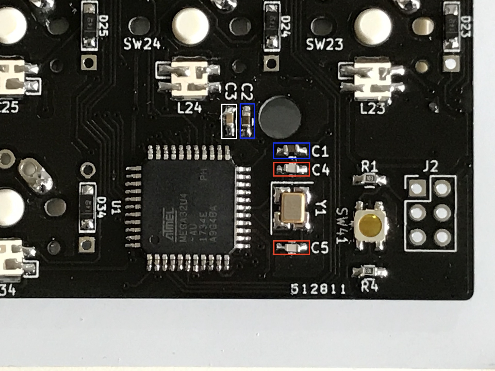
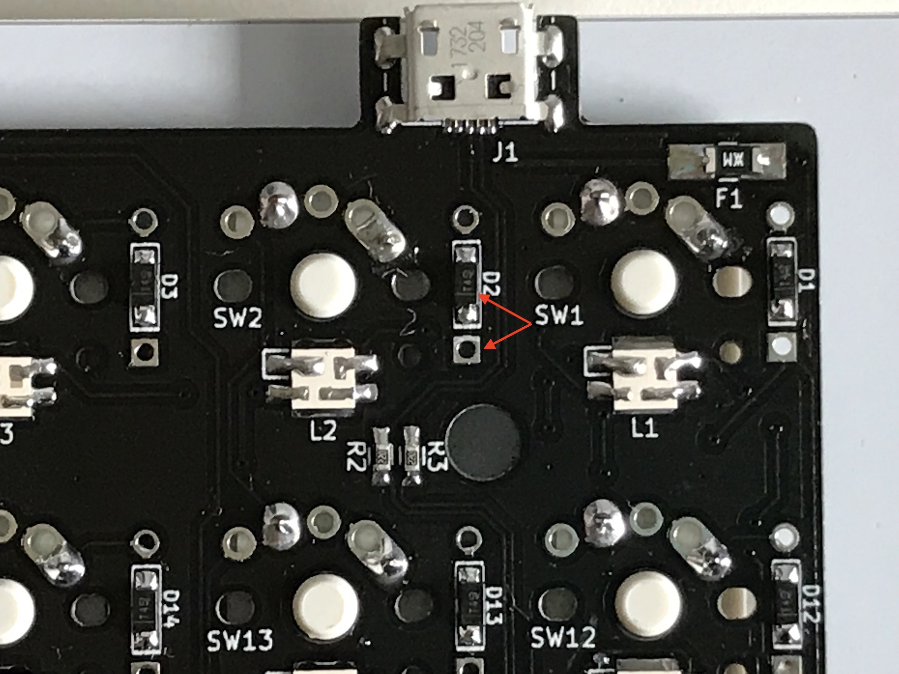
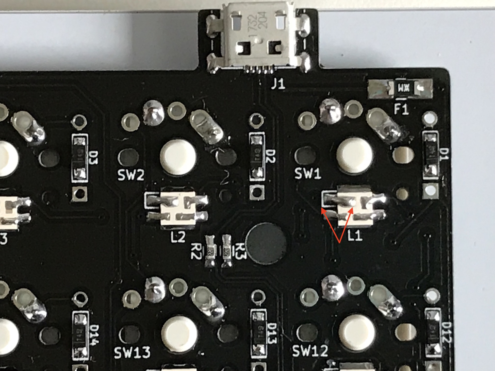
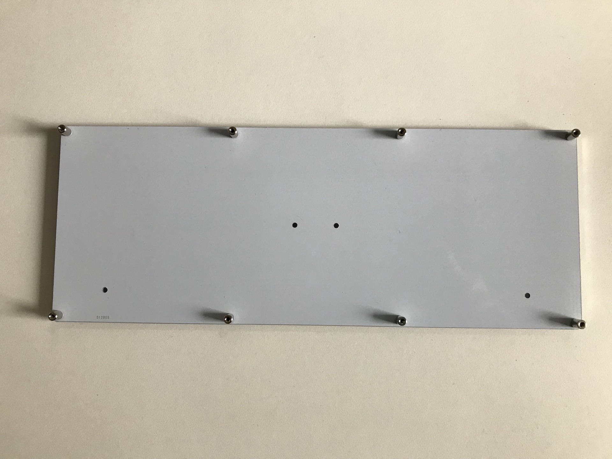
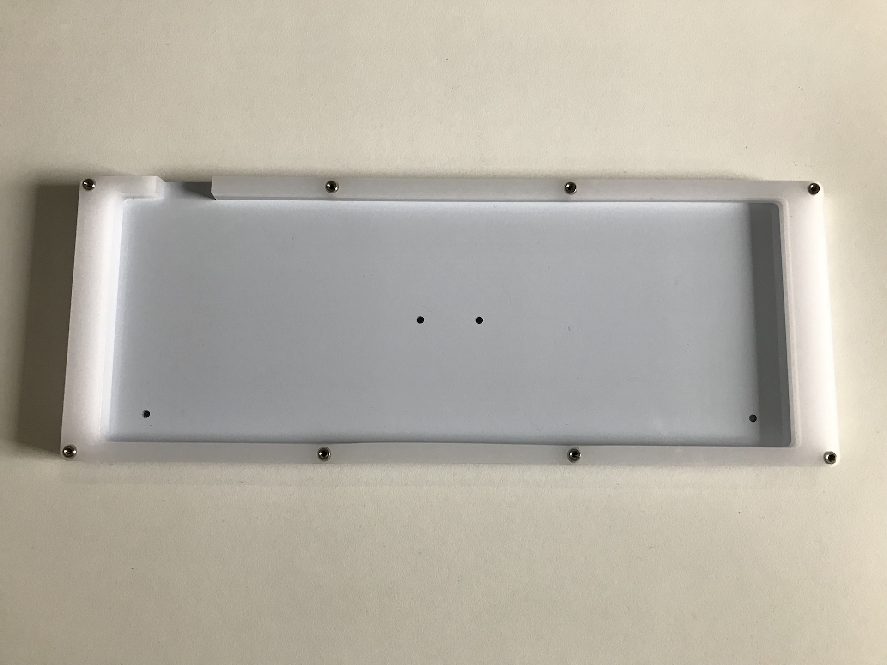
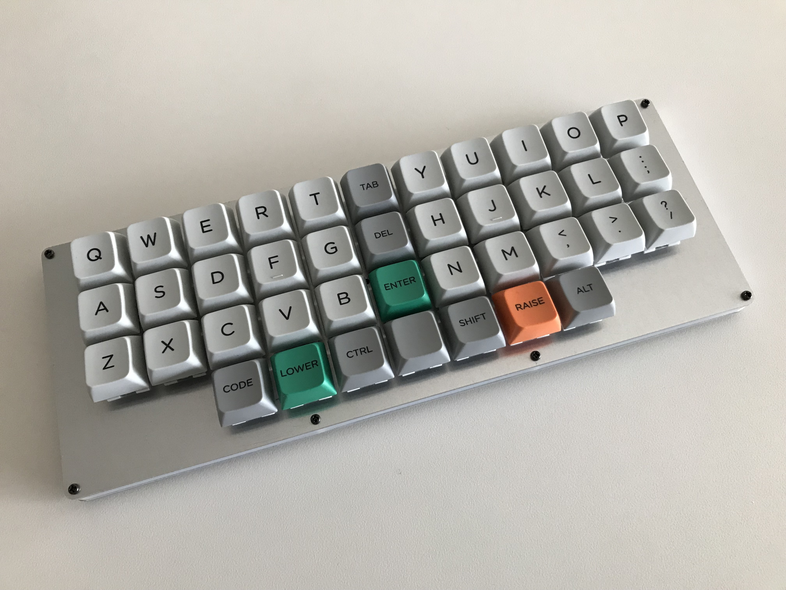

# Halberd build guide

## Before build
* Please be aware of injuries with soldering irons, tools, parts etc.
* When you leave your seat during work, please confirm that the soldering iron is turned off.
* Very small parts are included, so be careful not to lose.

## Confirm contents
The following parts are included in the kit. Please check whether there is any shortage before work.

Number | Name | Value | Qty | Remarks | Place 
:----|:--------|:-----|:----|:-----------------|:-------
1  | PCB | | 1 | | 
2  | Capacitor | 1μF | 3  | 1 spare, colored with blue marker.| C1, C2 
3  | Resistor | 22Ω | 3 | 1 spare, colored with yellow marker, marked "220" on the package. | R2, R3
4  | Resistor | 10kΩ | 3 | 1 spare, colored with green marker, marked "103" on the package. | R1, R4
5  | Capacitor | 22pF | 3 | 1 spare, colored with red marker. | C4, C5
6  | コンデンサ | 0.1μF | 2 | 1 spare, no marker. | C3
7  | Crystal oscillator | FA238-16MHz | 1 | | Y1
8 | Tact switch | TVAF17-WEC-R | 1 | | SW41
9 | Resettable fuse | nanoSMDC050F/13.2 | 1 | | F1
10  | MPU | ATMEGA32U4-AU | 1 | | U1
11  | USB connector | MicroB female | 1 | | J1 
12 | Diode | 1N4148W | 40 | | D1 - D40
13 | Top plate | | 1 | |
14 | Bottom plate | | 1 | |
15 | Middle plate | | 2 | |
16 | M2 standoff | 6mm | 9 | |
17 | M2 screw | 5mm | 18 | |
18 | Rubber feet | | 4 | |

## Other required items
In order to complete the kit, the following parts must be prepared separately.

* Key switch (Cherry MX compatible only support. Low-profile type is not supported)
* Key caps
* USB Micro B cable (for connection with PC)

When installing the optional backlight, the following parts must be prepared separately.

* SK6812MINI x 40

## Required tools

In order to build, the following tools are required at minimum.

* Soldering iron (preferred temperature controllable)
* Lead solder
* Tweezers
* Phillips head screwdriver
* Magnifier
* Flux
* Multimeter

In addition, you may also prepare the following as necessary.

* Flux remover
* Solder wick

## Solder MPUs

1. Place the ● mark (pin 1 marking) on the MPU aligned with the ○ mark on the board.
2. Make sure that all pins are on the pad and solder them.

For the QFP package soldering, this [movie](https://www.youtube.com/watch?v=-8SRkSjkZ8A) may be helpful.

## Solder crystal oscilators

1. Align the long side of the crystal oscillator (which may be either long side) so that it comes to the position of the part number (Y1) on the board and place it at the center of the four pads.
2. Since the terminal can be seen only a little at the corner of the crystal oscillator, solder is poured while warming it at the tip of the crystal.

This [movie](https://www.youtube.com/watch?v=14fJTgFg03M) may be helpful for soldering SMD crystal oscillator.

## Solder resistors

1. Resistors(R1-R4) are really small so they lose sight of it quickly. When soldering, remove them one at a time from the tape.

## Solder capacitors

1. Since capacitors(C1-C5) are not written with numbers or letters on the parts themselves, it is impossible to distinguish them by looking at things with different values, so be careful.

## Solder resettable fuse

1. Solder the resettable fuse F1.

## Solder USB connector

1. If soldering from the pin part first rather than the outer through hole part, it can be installed without misalignment. Apply a lot of flux on the pins and pads, put a small amount of solder on the tip in advance, and touch the pins lightly.
2. When bridging, scrape off excess solder with a clean iron tip.
3. _Do not forget to solder the through hole pins._

## Solder tactile switch

1. Since the tactile switch has a little metallic part on the side, apply a soldering iron to that part and let the solder flow.

## Solder diodes

1. The diodes(D1-D40) has a mounting orientation. Align the part of one side of the package that is painted white and bandlike to the position of the vertical bar of the diode symbol on the board.

## Solder backlight LEDs (optional)

1. Solder the LEDs(L1-L40).
2. The LEDs have a mounting orientation. Align the largest pad on the LED with white framed pad on the board. 
   

## Check whether the soldering is properly done

Refer to the [schematic](files/halberd.pdf) and check whether soldering is correctly done.

Before connecting to the computer, at least check the followings.

1. Check that there is no short circuit between UVCC - GND and VCC - GND.
2. Make sure the MPU pins are not bridged.
3. Make sure the USB connector pins are not bridged.

## Verify that it is recognized as a USB device

Connect the keyboard to the computer and confirm that it is recognized as a USB device.

* For Mac, start "System Information" and check whether the device named "ATm32U4DFU" is visible.
  

* For Windows, I have not tried it because I do not have the environment at hand, but it seems to appear as "ATm32U4DFU" in the device manager.

If it is not recognized as a USB device, please double check the schematic to see if all parts are properly soldered.

For Windows, the driver may not be installed. Download the driver from the link below, install it, and check again.

[Driver for Windows](https://gallery.microchip.com/packages/Atmel-USB-Installer-7.0/1.0.0)

## Attach the key switches to the top plate

1. Attach the key switches to the top plate.
   

## Combine PCB and top plate

1. Combine the PCB and top plate.
2. Press the key switches firmly into the PCB and check that the bottom of the key switches are in contact with the PCB.

## Solder key switches

1. Solder the key switches.
   

## Assemble the case
1. Insert the M2x5mm screw into the bottom plate and attach the spacer.

2. Align the spacer holes on the middle plate with the spacers attached to the bottom plate, and overlay the middle plate on the bottom plate. _Be careful when handling the middle plate because it is very easy to break._

3. Place the top plate on the middle plate and tighten with M2x5mm screws.
4. The top and bottom plates also have a hole that can be screwed to the center. Screw it if necessary.

## Attach rubber feet

1. Attach the rubber feet to the bottom plate.

## Attach the key caps
1. Attach your favorite keycaps.

## Write firmware
The firmware uses QMK. Please clone the following repository.

[qmk_firmware](https://github.com/qmk/qmk_firmware)

After cloning, move to the directory of the local repository and execute the following command, the standby state will be entered to write the firmware, please connect the keyboard. If the keyboard is already connected, writing will begin.

~~~
$ make halberd:default:dfu
~~~

It is not necessary to press the reset switch to write the firmware for the first time.

Please refer to [this document](https://docs.qmk.fm/#/getting_started_build_tools) for building the environment for building firmware.

## Completed!
Congratulation!
